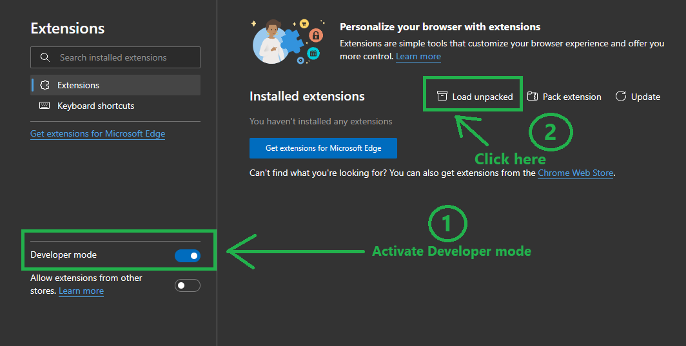
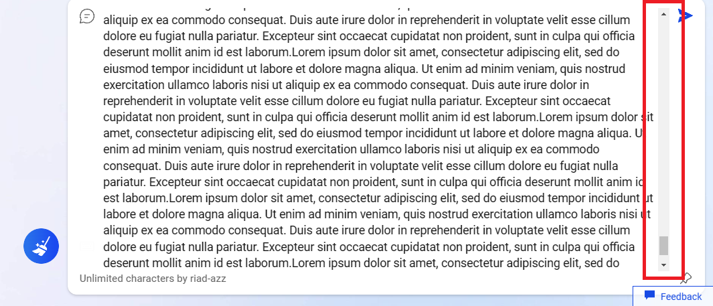

# Bing No Chracter Limit

Remove the character limit for Bing AI search.

## Description

An extension that removes character limit for Bing AI search it helps you bypasses the default limit of 2000 characters and enables you to interact with Bing AI more freely and comprehensively. The extension is compatible with Microsoft Edge but it should work on other browsers too if you managed to make the search work on them.

## Getting Started

## Installation

- Clone the repository or download the zip file and extract it

```bash
git clone https://github.com/riad-azz/youtube-to-mp3.git
```

- Open your edge browser and head to `edge://extensions/`



- After activating "Developer mode" and clicking "Load unpacked" select the repository folder that you downloaded or cloned and you should be all good!

### Extension Preview

- If your installation was successful you should be able to write with no limitations



## Disclaimer

**The maximum characters i tested was 10k and i got a pretty decent and accurate response, this may remove the character limit but AI might malfunction based on how long your request will be.**

## License

This project is licensed under the [MIT] License - see the LICENSE.md file for details
